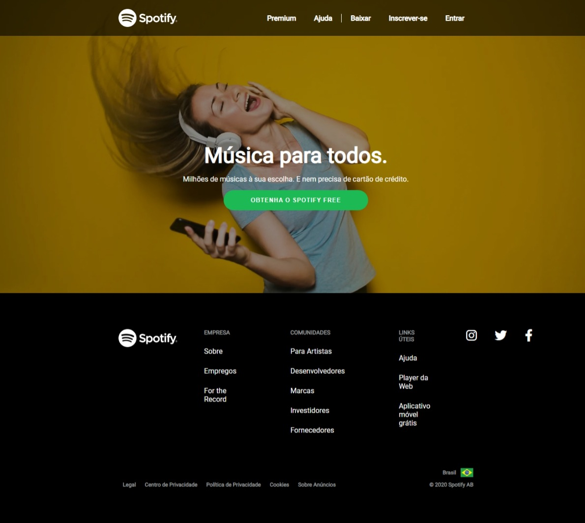

## Clone do Spotify 

Bem-vindo! 

Te apresento o clone do Spotify. Usei o site do Spotify como referência para treino de HTML e do CSS.

O resultado você pode conferir aqui.

## Layout desenvolvido pela Spotify com algumas adaptações feitas por mim

O clone tem como resultado final realmente uma cópia do site original, como forma de treino das linguagens.

## Conheça o aplicativo clicando no link
https://polysaantana.github.io/Clone-Spotify/

  

### Ferramentas utilizadas: 

* Site Spotify

* Vscode
 

### Tecnologias:

* HTML

* CSS

### Autora:
<table>
  <tbody>
    <tr>
	    <td align="center" valign="top">  <a href="https://github.com/polysaantana"> 
            
Polyanna
 </a>
      </td>
      </td>
    </tr>
  </tbody>
</table>